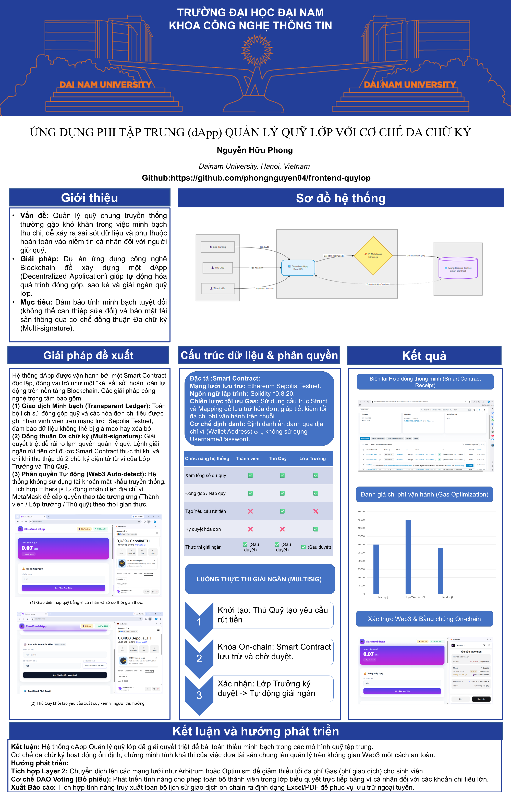

# 🎓 Decentralized Class Fund Management (dApp Quản Lý Quỹ Lớp)

[](https://reactjs.org/)
[](https://vitejs.dev/)
[](https://soliditylang.org/)
[](https://ethereum.org/)

## 📖 Giới thiệu dự án

Dự án là một Ứng dụng Phi tập trung (dApp) được phát triển nhằm mục đích quản lý tài chính, quỹ lớp học một cách minh bạch, an toàn và tự động hóa. Hệ thống giao tiếp trực tiếp với Smart Contract trên mạng lưới blockchain (Ethereum/Sepolia Testnet), loại bỏ rủi ro gian lận và sai sót trong quá trình quản lý thu/chi truyền thống.

## 🖼️ Tổng quan hệ thống (Poster)


*Chi tiết kiến trúc hệ thống và giao diện trực quan của dApp.*

## 🚀 Chức năng cốt lõi

Hệ thống được thiết kế với tư duy phân quyền chặt chẽ (Role-based access) thông qua ví Web3:

- **🔌 Tích hợp Web3:** Tự động kết nối và nhận diện định danh người dùng qua ví MetaMask.
- **👁️ Xem thông tin On-chain:** Truy xuất tổng số dư quỹ và lịch sử giao dịch minh bạch theo thời gian thực.
- **💰 Đóng góp & Nạp quỹ:** Cho phép tất cả thành viên trong lớp gửi ETH trực tiếp vào Smart Contract của quỹ.
- **✍️ Cơ chế Đa chữ ký (Multi-signature Workflow):**
  - **Thủ Quỹ:** Khởi tạo yêu cầu rút tiền/giải ngân kèm mục đích chi tiêu.
  - **Lớp Trưởng:** Kiểm tra và thực hiện thao tác Ký duyệt (Approve) trên Blockchain.
  - **Tự động hóa:** Tiền chỉ được Smart Contract tự động mở khóa và chuyển đi khi có đủ sự đồng thuận từ hai vai trò trên.

## 🛠️ Công nghệ sử dụng

### Frontend (Lớp Ứng dụng)
- **Core:** ReactJS (khởi tạo với Vite giúp build siêu tốc).
- **Web3 Integration:** Ethers.js (tương tác trực tiếp với Smart Contract).
- **Styling:** TailwindCSS (xây dựng giao diện UI/UX responsive và hiện đại).

### Backend / On-chain (Lớp Blockchain)
- **Ngôn ngữ Hợp đồng:** Solidity.
- **Môi trường Deploy:** Ethereum Sepolia Testnet.
- **Provider/Wallet:** MetaMask Extension.

## 💻 Hướng dẫn cài đặt & Chạy cục bộ

### 1. Yêu cầu hệ thống (Prerequisites)
- [Node.js](https://nodejs.org/en/) (phiên bản v16.x trở lên).
- Trình duyệt đã cài đặt tiện ích [MetaMask](https://metamask.io/).
- Mạng Sepolia Testnet đã được thêm vào MetaMask và có sẵn Testnet ETH để làm phí Gas.

### 2. Các bước cài đặt

1. Clone repository này về máy:
```bash
git clone https://github.com/phongnguyen04/frontend-quylop
```
2. Cài đặt các thư viện phụ thuộc (Dependencies):
```bash
npm install
```
3. Khởi chạy server phát triển:
```bash
npm run dev
```